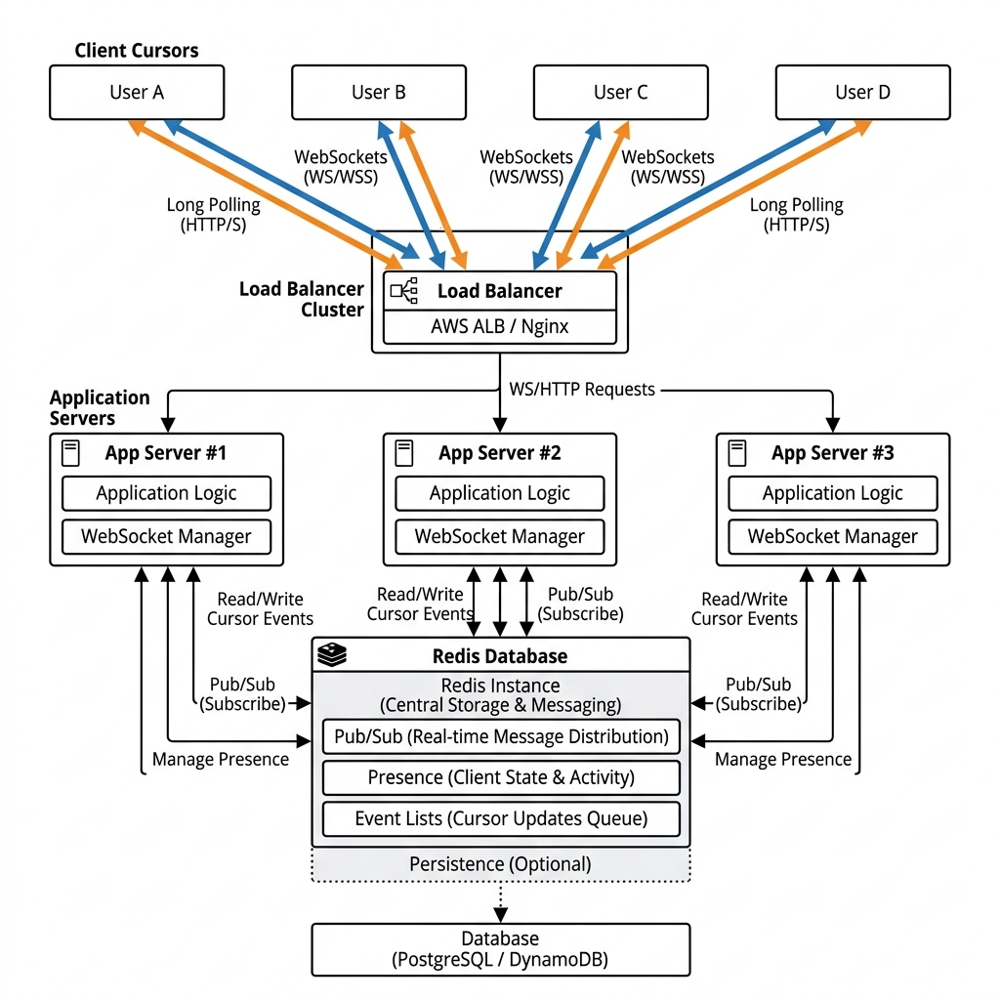
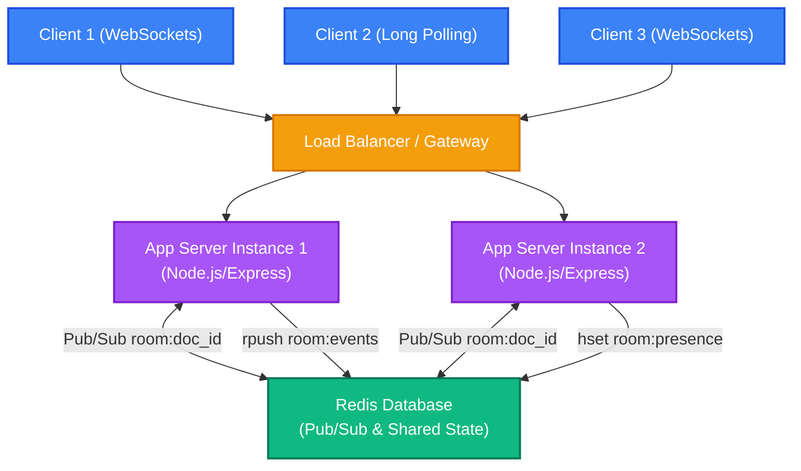
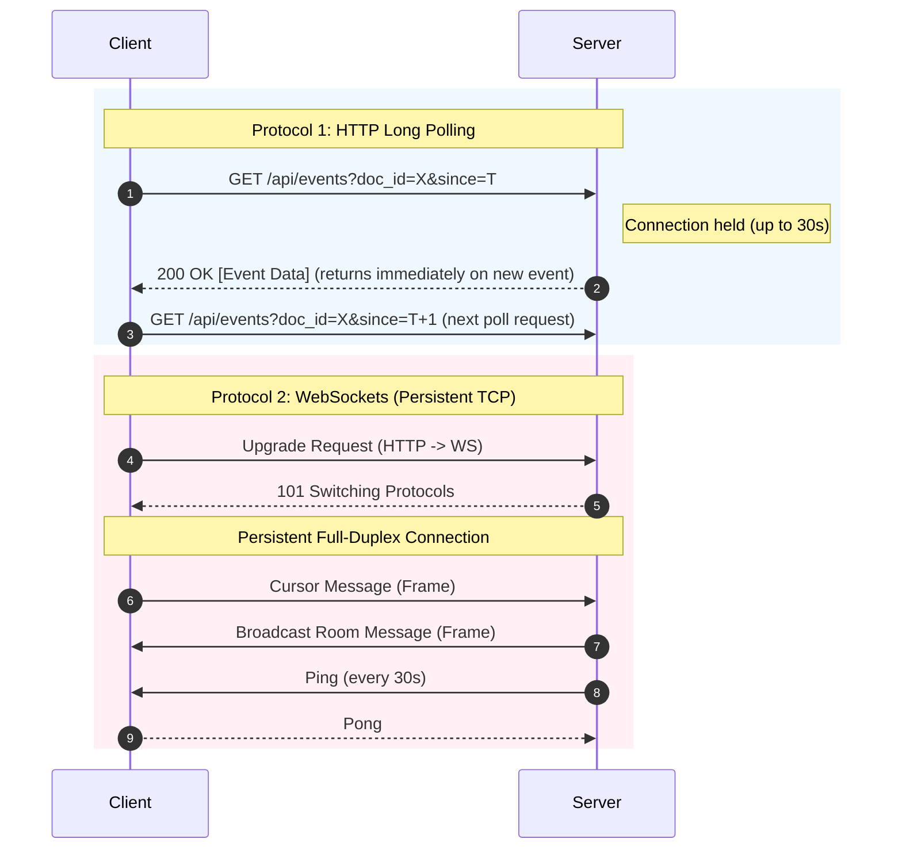
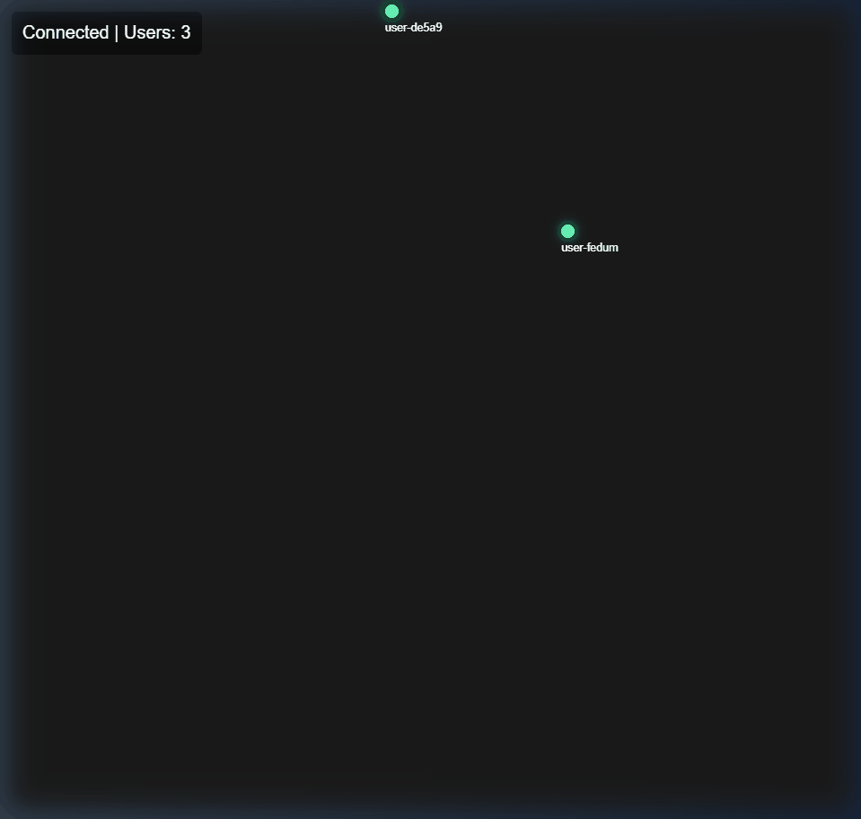
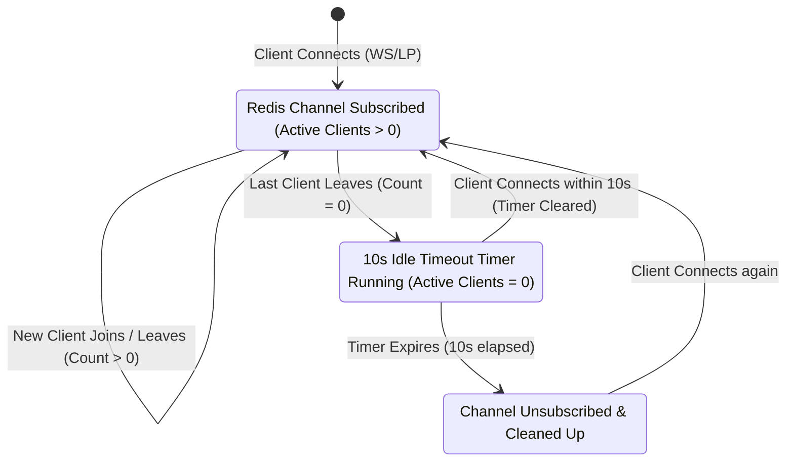

# Real-Time Collaboration Sync Engine: WebSockets vs HTTP Long Polling

A high-performance live document synchronization engine built to benchmark the trade-offs between **WebSockets (Full-Duplex)** and **HTTP Long Polling**. This project includes a complete benchmarking suite using **k6**, **Redis** for state management, and **Linux network simulation tools** for realistic WAN testing.

---

## 🏗️ System Architecture

Our synchronization engine utilizes a multi-instance scaling strategy using **Redis** as a distributed communication backplane.





---

## 🚀 Key Features

- **Dual-Protocol Sync**: Seamless cursor synchronization using both WebSockets and HTTP Long Polling.
- **Horizontal Scaling**: Multi-instance room management and message broadcasting powered by **Redis Pub/Sub**.
- **Distributed Presence**: Global room client tracking across all nodes using Redis Hash maps (`room:doc_id:presence`).
- **Resilient Fallbacks**: Smooth local in-memory fallback if Redis is unavailable or disconnected.
- **Performance Benchmarking**: Custom k6 metrics capturing nanosecond-level latency for both protocols.
- **Network Simulation**: Integrated tools to simulate 100ms latency and 2% packet loss for real-world WAN testing.
- **Graceful Shutdown**: Automatically registers `SIGINT`/`SIGTERM` handlers to clean up presence keys, terminate connections, and close the server safely.

---

## 🚦 Protocol Message Flows

Here is the difference in network roundtrips and connection lifecycle between the two protocols:



---

## 📊 Performance Comparison

Detailed analysis, latency CDF graphs, and protocol jitter animations are available in the **[REPORT.md](./REPORT.md)**.

### Latency Cumulative Distribution Function (CDF)

* *Green Line*: WebSockets (rapid convergence at low latencies)
* *Blue Line*: Long Polling (longer tail due to request/response overhead)

### Real-Time Cursor Jitter Comparison

* *Left (WebSockets)*: Continuous, fluid movement even with minor loss due to full-duplex delivery.
* *Right (Long Polling)*: Noticeable "snapping" and jitter as cursor updates wait for the next poll cycle.

---

## 🧠 Deep Dive: Scalability & Resilience Design

### 1. How Presence Scales Globally
- **The In-Memory Trap**: Tracking room client count locally (`wsClients.size`) works for a single server. In a multi-node setup, Server A doesn't know about Clients on Server B.
- **The Redis Solution**: When a WebSocket connects to an instance, that instance writes its local count to a Redis Hash (`room:doc_id:presence`) with its unique `instanceId` as the field name. The total room presence is the sum of all fields in the hash. This prevents count synchronization drift if an instance restarts or crashes.

### 2. Mitigating the Thundering Herd
- **The Problem**: In HTTP Long Polling, when a large number of GET connections time out simultaneously (e.g., at the 30s mark), they all reconnect at the exact same millisecond. This causes a massive CPU and TCP connection spike (TIME_WAIT socket exhaustion).
- **Mitigation**:
  - **Reconnection Jitter**: We introduce randomized jitter (delay offsets) on the client side during reconnection to smear the incoming requests over time.
  - **Synchronized Queuing**: The server batches event notifications, avoiding immediate wake-ups for individual micro-updates.

### 3. Synchronization under Network Degradation (WAN)
- **WebSockets**: Sustains high packet loss and latency (100ms latency, 2% loss) because it utilizes a single TCP connection. Dropped packets are retransmitted at the TCP layer, maintaining stream continuity.
- **Long Polling**: Latency escalates dramatically. Every state request requires a new TCP handshake (SYN, SYN-ACK, ACK) plus HTTP headers, multiplying the network round-trip overhead when packets are dropped.

### 4. Preventing Redis Subscription Thrashing
To prevent constant subscription and unsubscription operations during Long Polling cycles (which degrades performance), the server uses a stateful 10-second idle buffer:



---

## 🛠️ Tech Stack

- **Backend**: Node.js & Express
- **Real-time**: WebSockets (ws), HTTP Long Polling
- **State & Sync**: Redis (ioredis)
- **Load Testing**: k6
- **Containerization**: Docker & Docker Compose
- **Network Simulation**: iproute2 (tc/netem)

---

## 📋 Prerequisites

- Docker and Docker Compose
- Node.js (for running local scripts)
- k6 (optional, can be run via Docker)

---

## 🚦 Getting Started

### 1. Start the Environment
```bash
docker-compose up -d --build
```

### 2. Verify Health
```bash
docker-compose ps
# Ensure the 'app' container status is (healthy)
```

### 3. Visual Demo
Open your browser to test the real-time synchronization visually:
*   Navigate to: `http://localhost:3000/?doc_id=test-room`
*   Open the same link in a **second window** to see the synchronized cursors move in real-time.

---

## 📊 Benchmarking

### Thundering Herd Simulation
Test the server's ability to handle 100 simultaneous concurrent long-pollers:
```bash
node scripts/thundering-herd.js
```

### Protocol Benchmarks (via k6)
Run protocol-specific latency tests using the provided k6 scripts:

**Long Polling:**
```bash
# PowerShell
Get-Content benchmarks/k6_lp.js | docker run --rm -i --network realtime-sync-benchmark-engine_default grafana/k6 run -
# Bash
cat benchmarks/k6_lp.js | docker run --rm -i --network realtime-sync-benchmark-engine_default grafana/k6 run -
```

**WebSockets:**
```bash
# PowerShell
Get-Content benchmarks/k6_ws.js | docker run --rm -i --network realtime-sync-benchmark-engine_default grafana/k6 run -
# Bash
cat benchmarks/k6_ws.js | docker run --rm -i --network realtime-sync-benchmark-engine_default grafana/k6 run -
```

---

## 🌐 Network Simulation

To test the system under realistic WAN conditions (100ms delay, 2% loss):

1. **Apply Degradation:**
   ```bash
   docker-compose exec app /bin/bash ./scripts/network-degrade.sh
   ```
2. **Verify with Ping:**
   ```bash
   docker-compose exec app ping -c 4 localhost
   ```
3. **Reset to Normal:**
   ```bash
   docker-compose exec app /bin/bash ./scripts/network-reset.sh
   ```

---

## 🔌 API Reference

### HTTP Endpoints
- `POST /api/event`: Send cursor updates.
  - Body: `{ "doc_id": string, "x": float, "y": float, "user_id": string, "sent_at": string }`
- `GET /api/events?doc_id=X`: Long Polling listener for room updates.
- `GET /health`: Health check endpoint.

### WebSocket
- **URL**: `ws://localhost:3000/ws?doc_id=X`
- **Protocol**: 
  - Send/Receive: `{ "type": "cursor", "x": float, "y": float, ... }`
  - Presence: `{ "type": "presence", "count": X }` (Automatic on connection change)
  - Heartbeat: Supports 30s ping/pong.

---

## 📁 Project Structure
- `src/server.js`: Core engine logic.
- `benchmarks/`: k6 load testing scripts.
- `scripts/`: Network simulation and thundering herd utilities.
- `docker-compose.yml`: Infrastructure orchestration.
- `submission.json`: Project configuration manifest.
