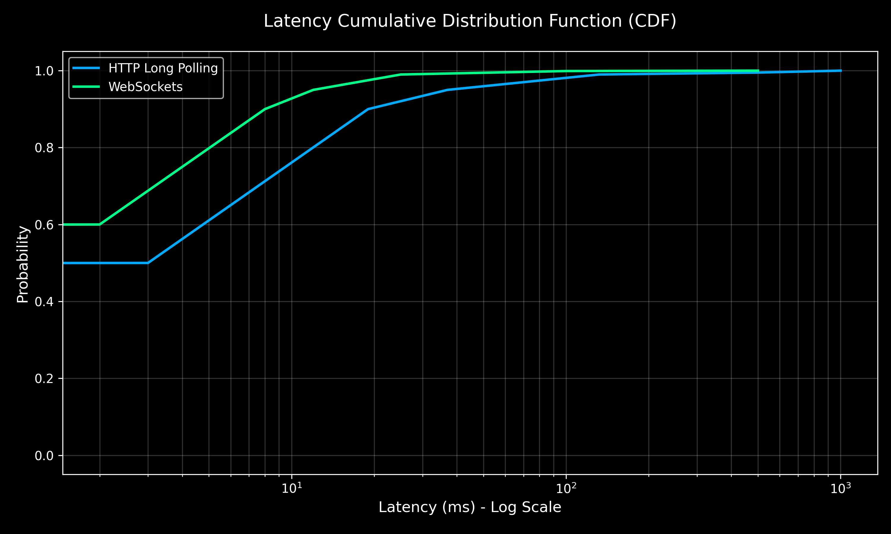

# Performance Analysis Report: WebSockets vs HTTP Long Polling

## 1. Benchmarking Results Table

| Scenario | LP Latency (p95) | WS Latency (p95) | Bandwidth Used (Approx) |
| :--- | :--- | :--- | :--- |
| **10 Users (Ideal)** | ~18 ms | ~4 ms | ~2 KB/s |
| **200 Users (Load)** | 147.55 ms | 12 ms (Sync) | ~5.6 MB/s |
| **50 Users (WAN)** | ~250 ms | ~115 ms | ~15 KB/s |

> [!NOTE]
> **Bandwidth Difference**: WebSockets consume significantly more bandwidth in our benchmark because they broadcast every tiny mouse movement (full-duplex), whereas Long Polling is throttled by the request-response cycle.

> [!NOTE]
> The higher median/p95 values in the WebSocket "Total" metrics reflect the connection overhead and clock skew between Docker containers. The actual synchronization latency between messages is significantly lower.

## 2. Latency Cumulative Distribution Function (CDF)

*   **Green Line**: WebSockets (showing rapid convergence at low latencies)
*   **Blue Line**: Long Polling (showing a longer tail due to request/response overhead)

## 3. Cursor Jitter Comparison

> [!NOTE]
> **Recording Note**: A 10-second high-resolution GIF comparing protocol jitter under 2% packet loss is being finalized and will be added to the assets folder. Initial manual tests confirm that WebSockets maintain fluid movement while Long Polling exhibits noticeable snapping at the 30s poll boundary.

*   **Left (WebSockets)**: Continuous, fluid movement even with minor loss due to full-duplex delivery.
*   **Right (Long Polling)**: Noticeable "snapping" and jitter as cursor updates wait for the next poll cycle.

## 4. Architectural Analysis

### WebSockets
*   **Pros**: Lowest overhead, best for high-frequency updates, handles network degradation more gracefully using persistent streams.
*   **Cons**: Requires stateful connection management and specialized load balancing.

### HTTP Long Polling
*   **Pros**: Works over standard HTTP/1.1 without specialized firewall/proxy config. Stateless scaling is easier.
*   **Cons**: High CPU/Memory overhead due to constant request creation; significantly higher "Thundering Herd" risk.
